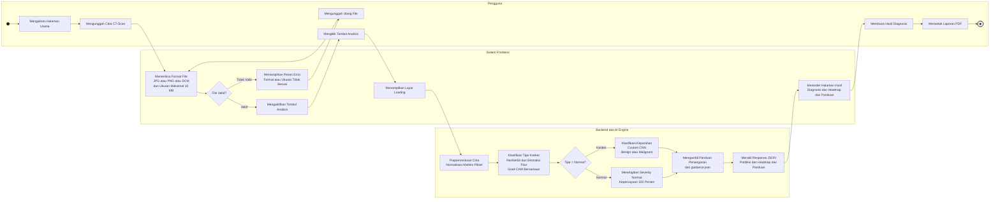
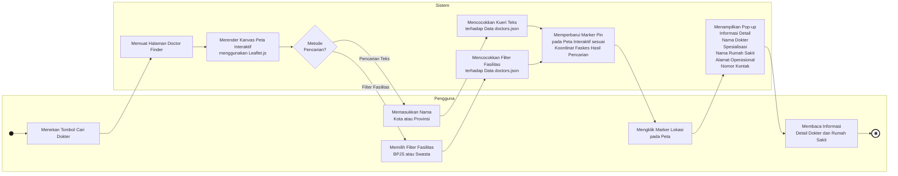

# Activity Diagram LungScan AI

Dokumen ini berisi dua activity diagram untuk jurnal sistem LungScan AI.
Diagram dibuat menggunakan sintaks Mermaid `flowchart LR` + `subgraph` sebagai swimlane,
kompatibel dengan **[mermaid.live](https://mermaid.live)**.

**Keterangan Notasi:**

| Simbol Mermaid | Bentuk UML | Nama |
|---|---|---|
| `((" "))` diisi hitam | ● Lingkaran penuh | **Initial Node** — Titik mulai |
| `((" "))` bergaris ganda | ◉ Lingkaran berbingkai | **Activity Final Node** — Titik selesai |
| `[Teks]` | Persegi panjang sudut membulat | **Activity** — Aktivitas/aksi |
| `{Teks?}` | Belah ketupat | **Decision Node** — Gerbang keputusan |
| `subgraph` | Jalur horizontal | **Swimlane** — Kolom partisipan |

---

## Gambar 4.7 Activity Diagram Skrining Diagnostik

---

## Gambar 4.8 Activity Diagram Fitur Pencarian Dokter

