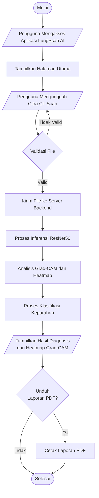
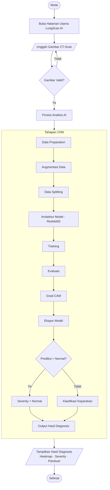
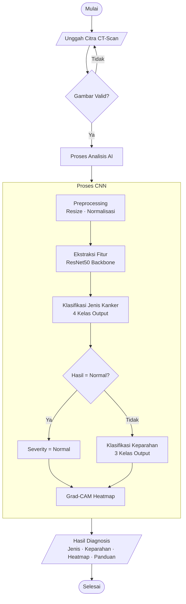

# Flowchart Sistem LungScan AI

Keterangan simbol:

| Simbol Mermaid | Bentuk | Nama Resmi |
|---|---|---|
| `([...])` | Oval | **Terminator** — Mulai / Selesai |
| `[/..../]` | Jajaran Genjang | **Input / Output** — Data masuk/keluar |
| `[...]` | Persegi Panjang | **Proses** — Pengolahan sistem |
| `{...}` | Belah Ketupat | **Decision** — Percabangan kondisi |

---

## Flowchart Sistem

---

## Flowchart Pipeline CNN

---

## Flowchart Proses Inferensi CNN

