# 📄 Product Requirements Document (PRD) & Minimum Viable Product (MVP) - LungScan AI

## 1. Ringkasan Eksekutif (Executive Summary)
LungScan AI adalah platform diagnostik berbasis kecerdasan buatan (AI) yang dirancang untuk membantu deteksi dini dan klasifikasi kanker paru-paru berdasarkan citra CT-Scan. Selain memberikan analisis medis dengan visualisasi yang dapat dijelaskan (*Explainable AI / Grad-CAM*), platform ini juga menyediakan direktori interaktif untuk menemukan dokter spesialis kanker paru terdekat di Indonesia serta panduan klinis awal.

## 2. Visi Produk
Menjadi alat bantu skrining kanker paru yang cepat, akurat, transparan, dan mudah diakses untuk memberdayakan pasien dan tenaga medis, serta menjembatani kesenjangan akses ke perawatan spesialis yang tepat.

## 3. Target Pengguna
- **Tenaga Medis (Dokter Umum/Radiolog):** Sebagai *second opinion* yang transparan untuk menganalisis CT-Scan sebelum membuat diagnosis final.
- **Pasien:** Untuk memahami potensi risiko, mendapatkan panduan penanganan pertama, dan mencari rujukan ke dokter spesialis terdekat.

---

## 4. Minimum Viable Product (MVP)
Fokus MVP adalah menghadirkan fungsionalitas inti yang stabil, akurat, dan *production-ready* dengan antarmuka premium.

### 🎯 Fitur Inti MVP:
1. **AI Diagnostic Pipeline (Analisis CT-Scan)**
   - **Upload Image:** Mendukung format standar (JPG, PNG) dan format medis (DCM) maksimal 10MB.
   - **Type Model:** Klasifikasi *Adenocarcinoma, Squamous Cell Carcinoma, Large Cell Carcinoma, atau Normal* dengan arsitektur ResNet50 (~88% akurasi).
   - **Severity Model:** Klasifikasi keparahan (status tumor) menjadi *Benign (Jinak), Malignant (Ganas), atau Normal*.
   - **Grad-CAM Heatmap:** *Explainable AI* yang menyoroti area paru-paru anomali untuk memvalidasi prediksi model.

2. **Actionable Clinical Guidance (Panduan Penanganan)**
   - Berdasarkan hasil diagnosis, sistem memberikan anjuran langkah pertama (*Do's & Don'ts*).
   - Penentuan *Tingkat Urgensi* dan saran *Waktu Konsultasi Maksimal* (misalnya: 1-3 Hari atau 24-48 Jam).

3. **Dashboard Transparansi Model (Metrics)**
   - Menampilkan performa model secara riil pada *test set* langsung di halaman hasil (akurasi, *precision*, *recall*, *F1-score*, baik *overall* maupun *per-class*).

4. **Doctor & Hospital Finder (Pencarian Dokter)**
   - Direktori berisi 50+ Dokter Spesialis Kanker Paru di Indonesia.
   - Peta interaktif (Leaflet.js) yang terintegrasi untuk menampilkan rumah sakit rujukan.

5. **Laporan & Regulasi**
   - **Cetak Laporan PDF:** Kemampuan untuk mencetak hasil analisis dan *heatmap* menjadi dokumen laporan (`window.print()`).
   - **Info & Disclaimer:** Halaman khusus berisi edukasi batasan AI, *disclaimer* medis yang diwajibkan, serta kebijakan privasi (sistem tidak menyimpan gambar pengguna).
   - **Dataset Transparency:** Galeri dataset yang digunakan model untuk tujuan edukasi pengguna.

---

## 5. Alur Kerja (User, System, & AI Flow)
Alur interaksi antara Pengguna, Sistem (Frontend & Backend), dan Engine AI dalam platform LungScan AI digambarkan sebagai berikut:

```mermaid
sequenceDiagram
    autonumber
    actor User as Pengguna (Pasien/Dokter)
    participant SysFE as System (React Frontend)
    participant SysBE as System (FastAPI Backend)
    participant AI as AI Engine (TensorFlow/ResNet50)

    User->>SysFE: Unggah Citra CT-Scan (.png/.jpg/.dcm)
    SysFE->>SysFE: Validasi Ukuran (<10MB) & Format
    SysFE->>SysBE: Kirim file (POST /api/predict)
    SysBE->>SysBE: Preproses Gambar (Resize 460x460 & 224x224)
    
    rect rgb(30, 41, 59)
        note right of SysBE: Pipeline Inferensi AI
        SysBE->>AI: Predict Type & Extract Conv Features (ResNet50)
        AI-->>SysBE: Hasil Kelas Tipe & Fitur Konvolusi (15x15x2048)
        SysBE->>SysBE: Hitung Grad-CAM (BN-Corrected weights)
        
        alt Jika Tipe adalah "Normal"
            SysBE->>SysBE: Lewati Model Severity (Set 'Normal' 100% secara klinis)
        else Jika Tipe adalah Kanker (Adeno/Large/Squamous)
            SysBE->>AI: Predict Severity (Custom CNN)
            AI-->>SysBE: Hasil Kelas Keparahan (Benign/Malignant)
        end
    end

    SysBE->>SysBE: Reka Warna & Encode Heatmap (Base64 PNG)
    SysBE->>SysBE: Ambil Panduan Penanganan Medis (guidance.json)
    SysBE-->>SysFE: Respon Data Diagnostik Lengkap (Prediction, Severity, Heatmap, Guidance)
    SysFE-->>User: Tampilkan Hasil Diagnostik, Heatmap Overlay, & Panduan Penanganan
    
    opt Aksi Lanjutan Pengguna
        User->>SysFE: Klik "Cetak Laporan PDF" (Pemicu window.print)
        User->>SysFE: Klik "Cari Dokter" (Navigasi ke Peta Leaflet Rumah Sakit)
    end
```

### Penjelasan Detail Alur Kerja:
1. **Tahap Input & Preprocessing:**
   - **User** mengunggah gambar CT-Scan.
   - **System (Frontend)** memvalidasi agar file tidak melebihi 10MB dan berupa format yang didukung sebelum mengirimkannya ke backend.
   - **System (Backend)** mengubah ukuran gambar menjadi dua dimensi berbeda: `460x460` (untuk model tipe kanker) dan `224x224` (untuk model tingkat keparahan).

2. **Tahap Inferensi AI (Dual-Stage Pipeline):**
   - **AI Engine** menganalisis gambar `460x460` menggunakan model ResNet50 untuk mengklasifikasikan tipe kanker paru.
   - **System (Backend)** mengekstrak fitur konvolusi dari lapisan terakhir (`conv5_block3_out`) dan mengalikan bobot *Dense* yang telah dikoreksi *Batch Normalization* untuk memetakan lokasi kelainan (**Grad-CAM Heatmap**).
   - **Algoritma Keputusan**:
     - Jika hasil klasifikasi tipe adalah **Normal**, sistem langsung menetapkan tingkat keparahan sebagai **Normal (100% confidence)** tanpa memanggil model keparahan demi efisiensi resource.
     - Jika tipe terdeteksi kanker, sistem mengumpankan gambar `224x224` ke model kedua untuk memprediksi tingkat keparahan (*Benign* atau *Malignant*).

3. **Tahap Output & Tindakan Medis:**
   - **System (Backend)** memadukan visualisasi *heatmap* Grad-CAM ke dalam format base64 PNG, memuat rekomendasi penanganan (*Do's & Don'ts*) dari `guidance.json`, lalu mengirimkannya ke frontend.
   - **System (Frontend)** merender data tersebut secara interaktif. Pengguna dapat mengaktifkan/menonaktifkan overlay *heatmap* untuk melihat letak kanker, mencetak laporan PDF, atau mencari dokter spesialis paru terdekat melalui peta terintegrasi.

---

## 6. Arsitektur & Teknologi (Tech Stack)
- **Frontend:** React 19, Vite, Tailwind CSS, Framer Motion, GSAP, React Leaflet, Radix UI.
- **Backend:** Python FastAPI, TensorFlow/Keras, Uvicorn, PIL, NumPy.
- **Model AI:** ResNet50 (Klasifikasi Tipe), Custom CNN (Klasifikasi *Severity*).
- **Deployment:** Railway (via `railway.toml`), Docker.

## 7. Kriteria Keberhasilan (Success Metrics) MVP
1. **Akurasi Diagnostik:** Tingkat akurasi klasifikasi kanker di atas 85% untuk data *real-world*.
2. **Performa Sistem:** Waktu respons inferensi (Prediksi Tipe + Severity + Grad-CAM) < 5 detik.
3. **Stabilitas Frontend:** Map render sempurna (tanpa *blank map*), dan animasi berjalan mulus.

## 8. Rencana Pengembangan Lanjutan (Post-MVP)
- **Integrasi Booking:** Pemesanan jadwal langsung ke dokter spesialis yang dipilih via platform.
- **Dukungan 3D CT-Scan:** Pemrosesan gambar *multi-slice* untuk analisis volume paru-paru utuh.
- **User Accounts & History:** Sistem *login* untuk menyimpan riwayat *scan* pasien.
- **Export Laporan PDF Lanjutan:** *Generate* PDF *server-side* yang jauh lebih mendetail dan resmi, menggantikan fungsi pencetakan berbasis *browser* saat ini.
