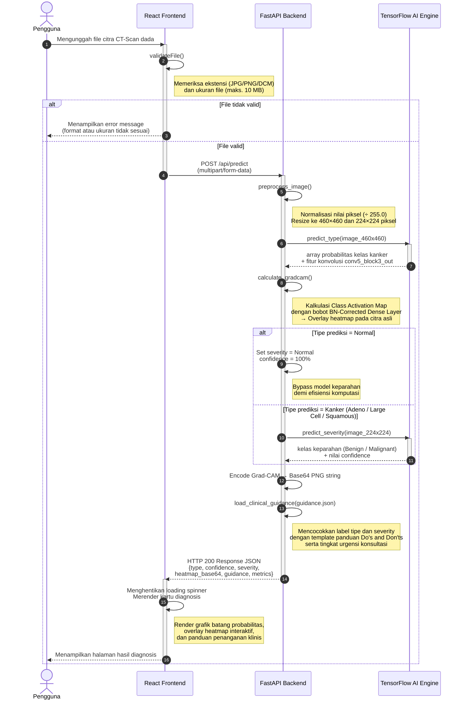
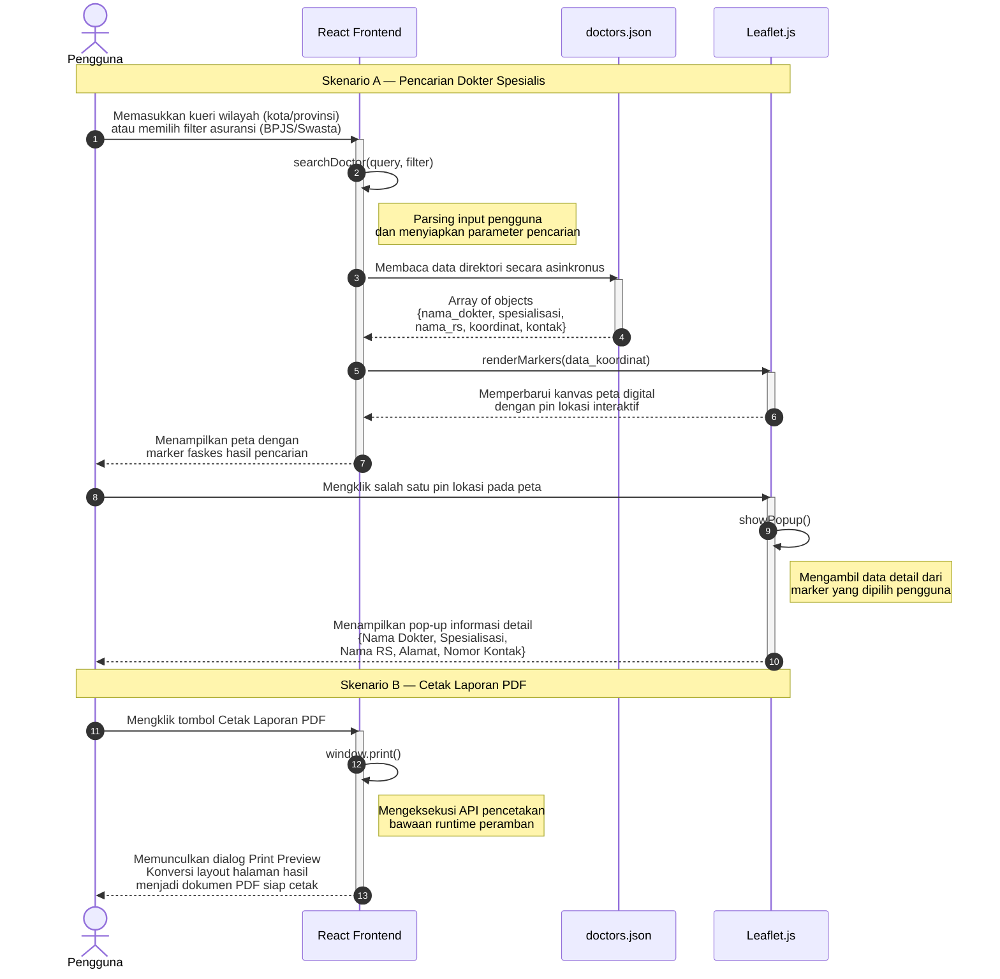

# Sequence Diagram LungScan AI

Dokumen ini berisi dua sequence diagram untuk jurnal sistem LungScan AI.
Diagram dibuat menggunakan sintaks `sequenceDiagram` Mermaid, kompatibel dengan **[mermaid.live](https://mermaid.live)**.

**Keterangan Notasi:**

| Simbol Mermaid | Makna |
|---|---|
| `actor` | Aktor manusia (Pengguna) |
| `participant` | Komponen sistem |
| `->>` | Pesan sinkron (synchronous message) |
| `-->>` | Pesan balasan (return / response) |
| `alt / else` | Blok kondisional (percabangan) |
| `activate / deactivate` | Aktivasi lifeline (eksekusi aktif) |
| `Note` | Anotasi / keterangan tambahan |

---

## Gambar 4.9 Sequence Diagram Skrining Diagnostik

---

## Gambar 4.10 Sequence Diagram Fitur Pencarian Dokter dan Cetak Laporan

