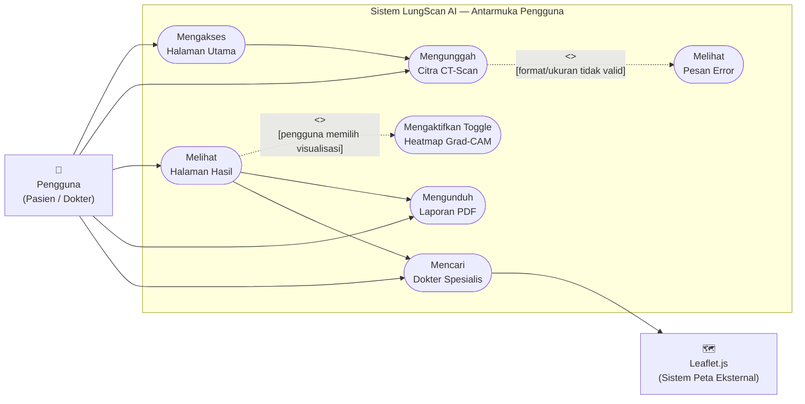
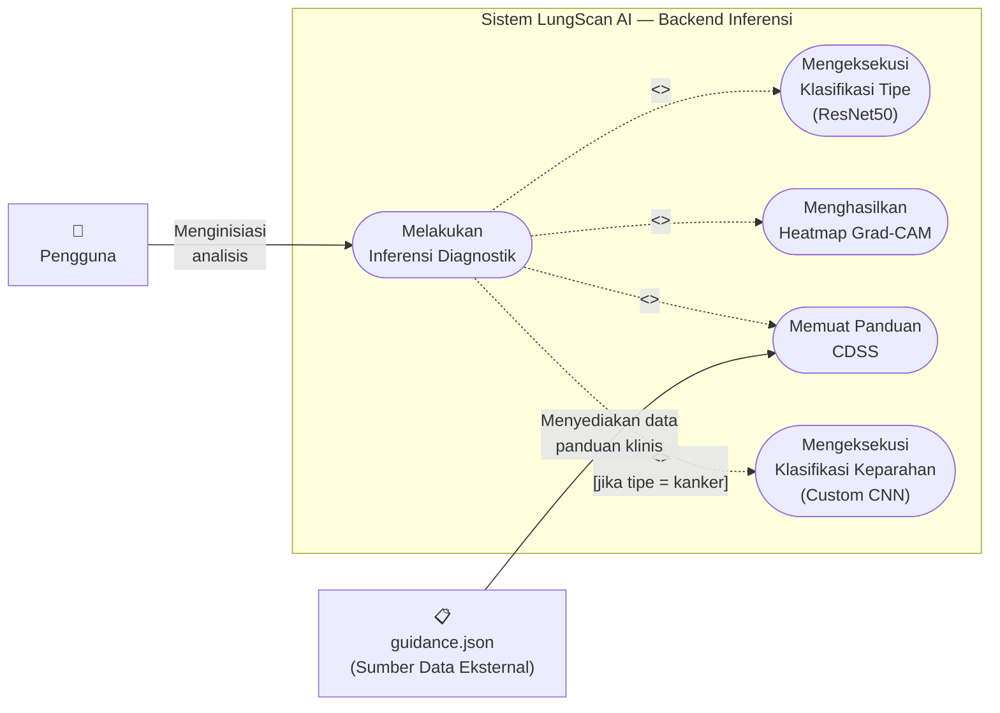

# Use Case Diagram LungScan AI

Dokumen ini berisi dua diagram use case untuk jurnal sistem LungScan AI.
Diagram dibuat menggunakan sintaks Mermaid (`flowchart`) yang kompatibel dengan **mermaid.live**.

**Keterangan Notasi:**
- Bentuk oval `(["..."])` → **Use Case**
- Bentuk kotak `["..."]` → **Aktor**
- Panah putus `-.->` dengan label `<<extend>>` → **Relasi Perluasan** (kondisional)
- Panah putus `-.->` dengan label `<<include>>` → **Relasi Keharusan** (selalu dipanggil)
- `subgraph` → **Batas Sistem (System Boundary)**

---

## Gambar 4.5 Use Case Antarmuka Pengguna

---

## Gambar 4.6 Use Case Alur Inferensi AI

